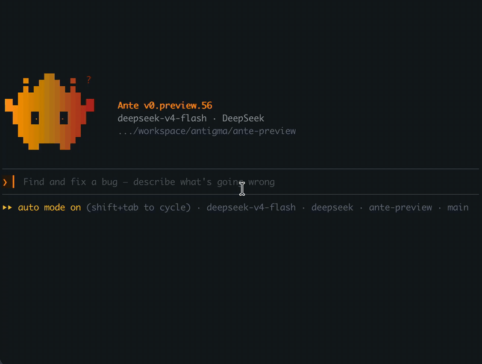
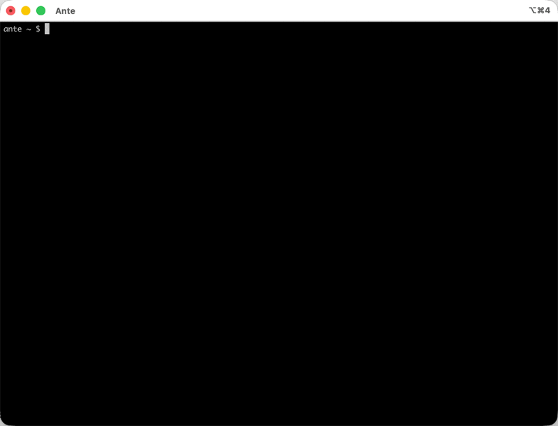
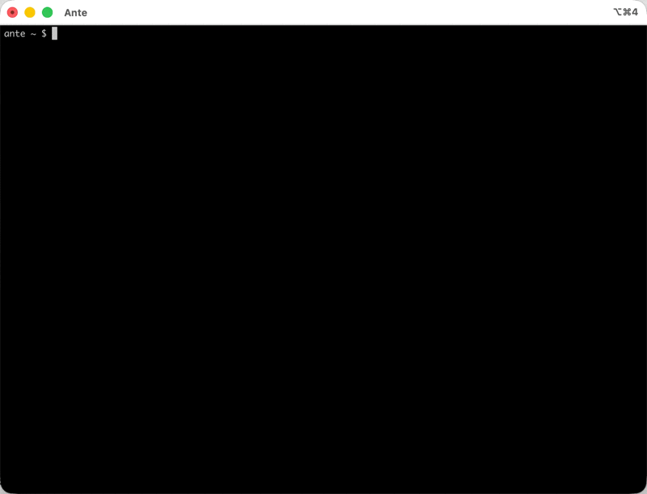
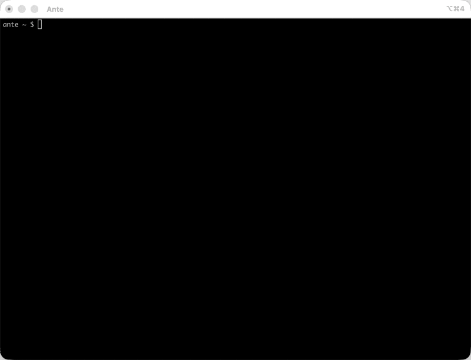

<p align="center">
  
</p>

<p align="center">
  <a href="https://antigma.ai/eval"></a>
  <a href="https://discord.gg/CbAsUR434B"></a>
  <a href="https://docs.antigma.ai"></a>
  <a href="https://twitter.com/antigma_labs"></a>
  <a href="https://huggingface.co/Antigma"></a>
</p>

# Ante

> **⚠️ Alpha Preview**
> Ante is currently in alpha and provided as a research preview. Expect breaking changes and incomplete functionality. macOS and Linux only.

**A ghost in your shell.** Ante is a self-contained coding agent that lives in your terminal and self-organizes. One ~15MB Rust binary from [Antigma Labs](https://antigma.ai), zero runtime dependencies, built to get the most out of any model.

It works like Claude Code or Codex, with none of their dependencies or model constraints. It can also be the optimized core for building your own harness and high-performing assistants.

> **We care about the harness, not the model or the prompts.**
>
> **Documentation is the new source code.**

Every agent claims to be good. Here are numbers you can check:

### 🥇 Proven in public, on the builds we ship

Ante runs [Terminal-Bench 2.1](https://antigma.ai/eval) continuously under official leaderboard constraints. For every model we run, Ante is the **#1 same-model agent**. Each result pins the exact build you can download and links the raw Harbor run for independent audit. With open-weight **GLM 5.2, Ante scores 74.6%**: a top-7 slot on the public verified leaderboard.

**[Live results →](https://antigma.ai/eval)** · [Methodology →](https://docs.antigma.ai/benchmarks/eval)

### 🪶 A fraction of the footprint

Ante is hand-written Rust with the heavy parts (`Grep`, `git`, local inference) embedded in one binary, one process. Across the same 20 parallel tasks in Docker, Ante uses **~7× less peak memory**, **~9× less average CPU**, and **~5× less disk I/O** than Claude Code.


**[Raw numbers →](https://docs.antigma.ai/benchmarks/compare_table)** · [Benchmark details →](https://docs.antigma.ai/benchmarks/eval)

### 🔌 Natively offline

Ante ships its own inference engine. Point it at a GGUF file and the whole loop runs on your machine: no API key, no account, no internet.

```sh
ante --offline-model ~/.ante/models/Qwen3.5-9B-Q4_K_M.gguf \
  -p "add error handling to src/main.rs"
```

**[Offline mode →](https://docs.antigma.ai/usage/offline)**

---

The three are one design decision. An agent you can **verify**, **afford**, and **run anywhere** is light enough to run by the *thousands*: the substrate for self-organizing intelligence.

## Beyond the headline numbers

- **Zero vendor lock-in** — Bring your own API key, subscription, or local model. Switch between 12+ providers freely. No account required — not even ours.
- **Client-daemon architecture** — Run as an interactive TUI, headless CLI, or long-lived server (`ante serve`).
- **Channel integrations** — Run Ante as a Slack or Discord bot with `ante gateway`.
- **Multi-agent orchestration** — Spawn sub-agents and coordinate complex tasks across independent, decentralized, and centralized architectures. [See the patterns →](https://docs.antigma.ai/experimental/agent-org)
- **ACP server** — Expose Ante over the [Agent Communication Protocol](https://agentcommunicationprotocol.dev) with `ante acp`. REST API with sync, async, and SSE streaming modes for multi-agent orchestration and programmatic integration. [Docs →](https://docs.antigma.ai/usage/acp-server)
- **Extensible** — Custom skills, sub-agents, MCP, and persistent memory across sessions.

## Quick Start

### Installation

Ante is distributed as a single, self-contained binary with no external dependencies — just download and run.

```sh
curl -fsSL https://ante.run/install.sh | bash

# Install a specific release channel
curl -fsSL https://ante.run/install.sh | bash -s -- nightly

# Install into a directory already on PATH
curl -fsSL https://ante.run/install.sh | ANTE_INSTALL_DIR=/usr/local/bin bash
```

### Interactive TUI

```sh
ante
```

### Headless Mode

```sh
# Fix a bug
ante -p "find and fix the failing test in src/auth"

# Review a diff
git diff | ante -p "review this for security issues"

# Use a different provider
ante --provider openai --model gpt-5.5 -p "refactor the database module"

# Resume a saved session
ante --resume ses_01ARZ3NDEKTSV4RRFFQ69G5FAV -p "now add tests"

# Run fully offline with a local GGUF model
ante --offline-model ~/.ante/models/Qwen3.5-9B-Q4_K_M.gguf \
  -p "add error handling to src/main.rs"
```

### Server Mode

```sh
ante serve
```

### Gateway Mode

```sh
ante gateway
```

### Update Ante

```sh
ante update

# One-off update from a different channel
ante update --channel nightly

# Roll back or pin to an exact release
ante update --version v0.preview.33
```

## Example Usages with TUI

<table>
<tr>
<td width="50%">

**[Models, Providers & Thinking](https://docs.antigma.ai/usage/models-and-thinking)**



</td>
<td width="50%">

**[Providing Context: Files & Folders](https://docs.antigma.ai/usage/providing-context)**



</td>
</tr>
<tr>
<td width="50%">

**[Interrupting & Steering](https://docs.antigma.ai/usage/steering)**



</td>
<td width="50%">

**[Subscription Login](https://docs.antigma.ai/usage/login)**



</td>
</tr>
</table>

[See all cookbook guides](https://docs.antigma.ai/usage/providers)

## Architecture

```
┌─────────────────────────────────────────────────────────────┐
│                         Clients                             │
│                                                             │
│   ┌───────────┐    ┌───────────┐    ┌────────────────────┐  │
│   │    TUI    │    │ Headless  │    │    ante serve      │  │
│   │  (ante)   │    │ (ante -p) │    │  (stdio / ws)      │  │
│   └─────┬─────┘    └─────┬─────┘    └─────────┬──────────┘  │
└─────────┼────────────────┼─────────────────────┼────────────┘
          │                │                     │
          ▼                ▼                     ▼
┌─────────────────────────────────────────────────────────────┐
│                         Daemon                              │
│                                                             │
│   Session ──▶ Turn ──▶ Step                                │
│                                                             │
│   ┌──────────┐  ┌──────────────┐  ┌───────────────────┐     │
│   │  Tools   │  │  Permission  │  │  Skills / Agents  │     │
│   └──────────┘  └──────────────┘  └───────────────────┘     │
└────────────────────────┬────────────────────────────────────┘
                         │
                         ▼
┌─────────────────────────────────────────────────────────────┐
│                     LLM Providers                           │
│                                                             │
│   Anthropic · OpenAI · Gemini · Grok · Open Router · Local  │
└─────────────────────────────────────────────────────────────┘

Note: `ante acp` exposes the same agent over ACP (REST + SSE),
making it accessible to other agents and orchestration platforms.
```

## Supported Providers

Ante works with 12+ providers out of the box:

| Provider | Example Models |
|----------|---------------|
| Anthropic | Claude Sonnet 4.5, Opus 4.6 |
| OpenAI | GPT-5 family |
| Google Gemini | Gemini 3 family |
| Grok (xAI) | Grok 4 |
| Open Router | Multiple providers |
| Local (GGUF) | Any GGUF model via built-in llama.cpp |
| ...and more | Vertex AI, Zai, Antix, OpenAI-compatible |

Configure providers via environment variables (`ANTHROPIC_API_KEY`, `OPENAI_API_KEY`, etc.) or OAuth. Add custom providers in `~/.ante/catalog.json`.

## The bigger picture

Ante is designed for **cellular-native** agents: like cells in an organism, tiny, expendable, massively replicated. That thesis is why the three headline claims exist. A cell-scale agent must be *verified* (reliability compounds at scale), *tiny* (every byte is multiplied by thousands), and *self-contained* (no runtime to install, no service to phone home to). Read more in our [philosophy](https://docs.antigma.ai/start/philosophy) and [agent organization patterns](https://docs.antigma.ai/experimental/agent-org).

## FAQ

### Why <span style="color: #f59e0b;">An</span>other <span style="color: #f59e0b;">Te</span>rminal agent?

The name is the answer: **An**other **Te**rminal agent — and *ante*, the stake you put on the table to play. Ante is fast, lightweight, and the only terminal agent with native local inference built in. We believe a self-contained agent core that self-organizes is the foundation of the coming agent economy.

<details>
<summary><b>How is Ante different than other agents</b></summary>
On the high level, it has most of your favorite features (Multi-agents, skills, etc.) of your favorite agents (like Claude Code, Codex, etc.)

- Ante is built from scratch in native Rust. We're obsessed with being self-contained — only essential libraries, no framework or runtime dependencies.

- You only need an LLM provider configured to run it. And if you have the hardware, you don't even need one — Ante natively supports a private inference engine.

- This resulted in ~15MB self-contained binary and multi-agent orchestration designed to run hundreds of replicas in parallel at scale.
See the [benchmark details](https://docs.antigma.ai/benchmarks/eval) across 20 parallel tasks for concrete numbers.

- Every claim above is backed by public, reproducible benchmarks of the exact builds we ship: see [antigma.ai/eval](https://antigma.ai/eval).

- No vendor lock-in, not even to ourselves. You don't need an account and can reuse your favorite API credentials.

</details>

<details>
<summary><b>What's your advantage over similar projects?</b></summary>

Most projects in this space are written in TypeScript or Python and carry heavy runtime dependencies (Node.js, CPython). In practice that usually means an order-of-magnitude larger resource footprint (often ~10×).

We genuinely mean it when we say the agent should be self-contained:

- Core components like `Grep` (fully rebuilt and customized) and `git` are **embedded into the same binary** (while maintaining ~15MB size) and run **in the same process** at runtime — not shelled out to external processes — to prevent accidental resource leakage.
- We've built our own inference engine from the ground up. (See [nanochat-rs](https://github.com/AntigmaLabs/nanochat-rs), a toy version of the kind of work that goes into it.)
- There's an opt-in, fully integrated server-side experience at [antix.antigma.ai](https://antix.antigma.ai).
- And much more in the pipeline — including a multi-agent platform.

Beyond the footprint, it comes down to agent architecture — and ultimately to *who* is building it, and with what philosophy. Anyone can fork a binary; taste and engineering rigor don't copy. Those differences leak into every detail of the product.

</details>

<details>
<summary><b>Why care about runtime optimization like memory and I/O if model inference is usually the biggest bottleneck?</b></summary>

For one-on-one agent interactions, runtime overhead like memory usage and I/O is often less important than model inference.

But our vision is much bigger: millions of agents self-organizing and communicating at massive scale. At that point, even small inefficiencies get multiplied millions or billions of times, so runtime optimization becomes economically significant.
</details>

<details>
<summary><b>Can I run Ante completely offline?</b></summary>

Yes. Ante has a built-in llama.cpp engine that runs GGUF models locally. It handles engine installation, model discovery, and memory management automatically. No API keys or internet connection required.
</details>

<details>
<summary><b>Can I use my own custom models or providers?</b></summary>

Yes. Create a `~/.ante/catalog.json` file to add or override providers and models with custom endpoints, API keys, and configurations. Any OpenAI-compatible API works.
</details>

<details>
<summary><b>What is the <code>ante serve</code> mode for?</b></summary>

Server mode runs Ante as a long-lived daemon that communicates over a structured JSONL protocol. It's ideal for building editor plugins, web UIs, and custom integrations on top of Ante.
</details>

## Documentation

> **Documentation is the new source code.**

Full documentation is available at [docs.antigma.ai](https://docs.antigma.ai).
The source code is in `docs-site/docs`
