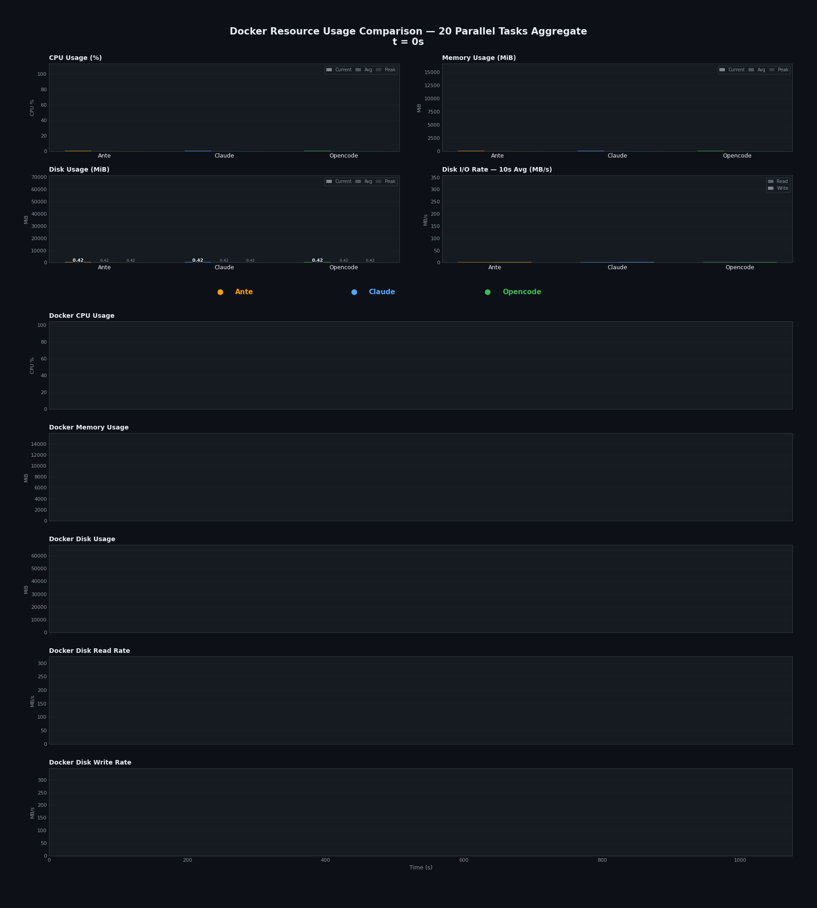

# 资源占用 {#resource-footprint}

大规模并行只有在单个智能体足够轻量化以支持成倍扩展时才有意义。为了衡量这一点，我们让 Ante、Claude Code 和 Opencode 在 Docker 内部同等限制条件下并行运行相同的 20 个任务，并记录了整个运行过程中的 CPU、内存和磁盘使用情况。

主要结论：在相同工作负载下，Ante 的**峰值内存使用率低了约 7 倍**，**平均 CPU 使用率低了约 9 倍**，并且**磁盘 I/O 少了约 5 倍**，相较于 Claude Code。

完整的测量数据如下。

## 概览 {#overview}

| 智能体 | 挂钟时间 (s) |
|-------|--------------|
| **Ante** | 940 |
| **Claude** | 627 |
| **Opencode** | 1076 |

## CPU 使用率 (%) {#cpu-usage}

| 智能体 | 峰值 | 平均 | P95 | P99 |
|-------|------|-----|-----|-----|
| **Ante** | 94.4 | 1.3 | 6.2 | 12.3 |
| **Claude** | 89.5 | 12.1 | 31.0 | 43.4 |
| **Opencode** | 90.8 | 3.8 | 27.1 | 62.3 |

## 内存使用量 (MiB) {#memory-usage-mib}

| 智能体 | 峰值 | 平均 | P95 | P99 |
|-------|------|-----|-----|-----|
| **Ante** | 1968 | 683 | 1489 | 1550 |
| **Claude** | 13877 | 3685 | 8927 | 9535 |
| **Opencode** | 12944 | 2077 | 11266 | 12852 |

## 磁盘使用量 (MiB) {#disk-usage-mib}

| 智能体 | 峰值 | 平均 | P95 | P99 |
|-------|------|-----|-----|-----|
| **Ante** | 7041 | 3121 | 6975 | 6976 |
| **Claude** | 22467 | 4304 | 10128 | 10193 |
| **Opencode** | 59689 | 6046 | 29108 | 34744 |

## 磁盘读取速率 (MB/s) {#disk-read-rate-mbs}

| 智能体 | 峰值 | P95 | P99 |
|-------|------|-----|-----|
| **Ante** | 3.5 | 0.0 | 0.1 |
| **Claude** | 263.9 | 10.4 | 101.9 |
| **Opencode** | 284.1 | 0.1 | 10.6 |

## 磁盘写入速率 (MB/s) {#disk-write-rate-mbs}

| 智能体 | 峰值 | P95 | P99 |
|-------|------|-----|-----|
| **Ante** | 186.3 | 3.6 | 61.7 |
| **Claude** | 302.3 | 26.6 | 113.0 |
| **Opencode** | 302.9 | 14.5 | 296.6 |

## 总磁盘 I/O (MB) {#total-disk-io-mb}

| 智能体 | 总读取 | 总写入 |
|-------|------------|-------------|
| **Ante** | 24 | 2785 |
| **Claude** | 17444 | 15116 |
| **Opencode** | 2224 | 31427 |
