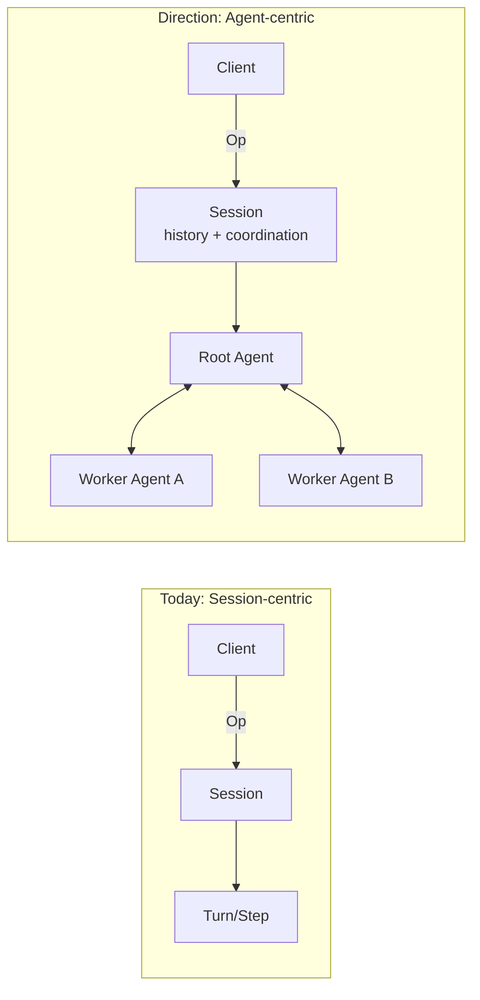

## 概览

Ante 遵循客户端-守护进程架构，实现了清晰的关注点分离。UI 和核心逻辑通过消息传递进行解耦，从而可以在不更改底层引擎的情况下替换前端（TUI、无头模式）。


## 客户端-守护进程拆分

```
┌────────────────┐          ┌─────────────────────────────┐
│     Client      │    Op    │          Daemon              │
│                 │ ───────▶ │                              │
│  TUI / Headless │          │  Session ─▶ Turn ─▶ Step    │
│  or Serve       │ ◀─────── │                              │
│                 │    Evt   │  Tools    Providers   Store  │
└────────────────┘          └─────────────────────────────┘
```

- **Client（客户端）** — 面向用户的层。基于 ratatui 的 TUI、无头 CLI 运行器，或通过 `ante serve` 连接的外部进程。发送 `Op`（操作）并渲染 `Evt`（事件）。
- **Daemon（守护进程）** — 核心引擎。接收操作，管理会话，向 LLM 提供商分发请求，调度工具执行，并发出事件。
- **Transport（传输层）** — 有界异步通道（Tokio）用于进程内客户端（TUI、无头模式），通过 stdin/stdout 传输 JSONL 用于外部客户端（`ante serve --stdio`），或通过 WebSocket 用于网络客户端（`ante serve --ws`）。消息 ID 支持跨边界的追踪。

## 架构方向：从以会话为中心到以智能体为中心

Ante 最初采用以会话（Session）为中心的运行时，其中 `Session` 是主要的执行所有者。我们正在向以智能体（Agent）为中心的运行时演进，其中长期存在的 `Agent` 实例拥有执行权并通过消息进行通信。



这类似于基于 Actor 的模型：

- **Agent as actor（智能体即 Actor）** — 每个智能体具有隔离的状态、一个邮箱和一个单一的逻辑执行循环。
- **Message-driven coordination（消息驱动协调）** — 智能体之间通过类型化的消息/事件进行协调，而不是共享可变状态。
- **Hierarchical supervision（层级监督）** — 父智能体可以生成子智能体，监控结果，并决定重试/升级策略。

为什么做出这种转变：

- 更好地隔离并发任务和子智能体
- 每个智能体拥有清晰的内存、权限和工具预算所有权
- 随着工作流变成多智能体模式，扩展性更具可预测性

在这个方向上，`Session` 仍然重要，但作为用户交互历史、持久化和协议层协调的容器，而不是唯一的执行单元。


## LLM 提供商

Ante 是与提供商无关的。每个提供商实现一个通用接口，用于发送提示词并接收流式响应。

| 提供商 | 传输格式 | 模型 |
|---|---|---|
| Anthropic | Messages API | Claude 系列 (haiku-4-5, sonnet-4-5, sonnet-4-6, opus-4-6) |
| Anthropic Subscription | Messages API | Claude 系列 (OAuth) |
| OpenAI | Responses API | GPT-5 系列 |
| OpenAI Compatible | Chat Completions | 自定义模型 |
| OpenAI Subscription | Responses API | GPT-5 系列 (通过 Codex 进行 OAuth) |
| Gemini | Gemini API | Gemini 3.1 系列 |
| Vertex AI Gemini | Gemini API | Gemini 3.1 系列 |
| Grok (xAI) | Responses API | Grok 4 |
| Zai | OpenAI-compatible | GLM-5.1 |
| Open Router | OpenAI-compatible | 多个提供商 |
| DeepSeek | OpenAI-compatible | DeepSeek V4 系列 |
| Ali Coding Plan | Messages API | 通过 DashScope 的 Qwen, Kimi, GLM, MiniMax |
| Antix | Anthropic Messages | 通过 Antigma 的 Claude, GPT, Gemini, Qwen, DeepSeek |
| Local | OpenAI-compatible | 通过 llama.cpp 的 GGUF 模型 |

提供商在会话初始化时从目录中解析。用户可以通过 CLI 标志（`--provider`，`--model`）或持久化设置进行覆盖。

### 身份验证

- **API 密钥** — 通过环境变量设置（`ANTHROPIC_API_KEY`, `OPENAI_API_KEY`, `GEMINI_API_KEY`, `XAI_API_KEY`, `OPENROUTER_API_KEY`, `OPENAI_COMPATIBLE_API_KEY`, `ZAI_API_KEY`, `DEEPSEEK_API_KEY`, `ALI_CODING_PLAN_API_KEY`, `VERTEX_GEMINI_API_KEY`, `ANTIX_API_KEY`）
- **OAuth** — 支持通过 TUI 处理 Anthropic、OpenAI 和 Antix 的交互式 OAuth 流程

## 工具系统

工具是智能体的手。每个工具实现 `Tool` trait：

```rust
#[async_trait]
pub trait Tool: Send + Sync {
    fn metadata(&self) -> &ToolMetadata;
    async fn call(&self, input: ToolCallInput) -> Result<ToolCallOutput>;
}
```

### 内置工具

| 工具 | 分类 | 需要审批 | 描述 |
|---|---|---|---|
| `Read` | 文件 I/O | 否 | 读取文本、图片或 PDF 文件内容 |
| `Write` | 文件 I/O | 是 | 创建或覆盖文件 |
| `Edit` | 文件 I/O | 是 | 替换文件中的精确字符串 |
| `Glob` | 文件 I/O | 否 | 按模式查找文件 |
| `Grep` | 文件 I/O | 否 | 使用正则表达式搜索文件内容 |
| `Bash` | Shell | 是 | 执行 shell 命令；支持用于长时间运行进程的 `run_in_background` |
| `PTY` | Shell | 否 | 驱动持久的 tmux 会话用于交互式程序（选择性加入） |
| `Agent` | 内置 | 否 | 为复杂任务生成子智能体 |
| `TodoWrite` | 内置 | 否 | 管理任务列表 |
| `WebFetch` | 内置 | 是 | 获取和处理网页内容 |
| `WebSearch` | 内置 | 是 | 搜索网页（在支持网页搜索的提供商上自动启用） |
| `ViewImage` | 内置 | 否 | 读取和分析图片（选择性加入） |
| `Browser` | Web | 是 | 通过 CDP 驱动 Chromium（需要 `browser` cargo 特性） |

### 工具过滤

工具可以在会话级别进行过滤：

- **包含列表** (`--include-tools`) — 仅这些工具可用
- **排除列表** (`--exclude-tools`) — 移除这些工具
- 支持 ToolMatcher 语法：`Bash(ls -la)`，`Agent(explore)`
- 名称匹配不区分大小写
- 相同的选择门控机制适用于动态注册的工具（MCP 服务器），因此它们无法绕过过滤器。

## 会话生命周期

1. 客户端发送包含模型、提供商和策略的 `Op::StartSession`
2. 守护进程解析提供商，进行身份验证，并发现技能和子智能体
3. 守护进程创建一个 `Session` 并发出 `Evt::SessionStart`
4. 用户发送 `Op::UserInput` 开始一个任务
5. 会话生成一个 `Turn` 与 LLM 进行通信
6. 回合（Turn）执行工具、请求审批，并最终完成
7. 当上下文预算接近限制时，自动压缩机制会总结历史记录
