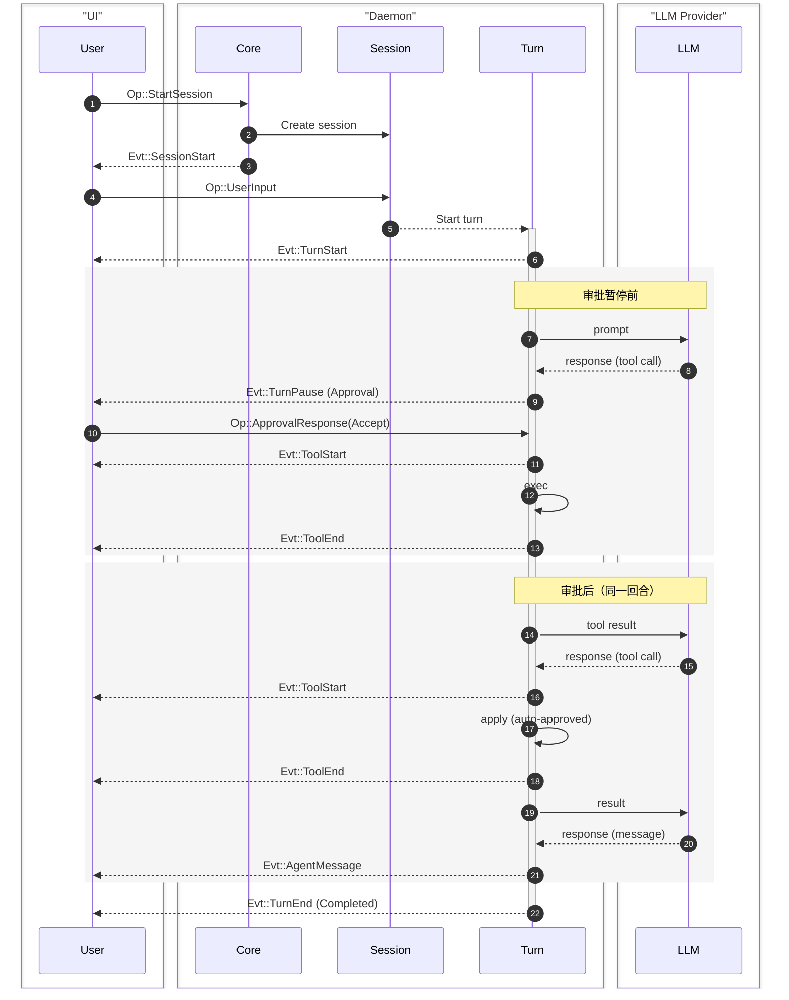
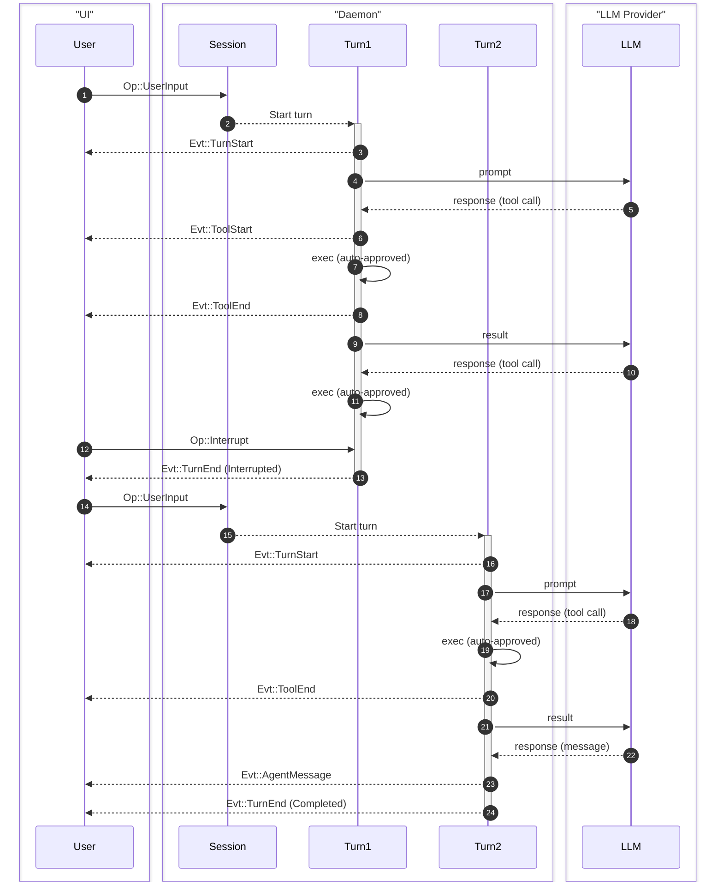

Ante 将智能体交互建模为概念的层级结构，通过类型化的消息传递协议进行连接。

## 概念层级

```
Project
 └── Session
      └── Task
           └── Turn
                └── Step
```

| 概念 | 描述 |
|---|---|
| **Project** | 一个 Git 仓库或根目录。可以有多个会话。 |
| **Session** | 用户和 Ante 之间的一次交互。管理对话状态、Token 使用情况和上下文压缩。 |
| **Task** | 用户希望完成的一项工作。可以跨越多个回合。 |
| **Turn** | 与智能体的一轮往返交互。以用户输入开始，以智能体消息或审批请求结束。 |
| **Step** | 智能体与 LLM 的一次交互。处理工具调用和其他机制。 |

:::note
通常，如果没有审批中断，一个任务由一个回合组成。
:::

## 协议：操作与事件

Ante 在客户端（TUI 或无头模式运行器）与守护进程之间使用消息传递协议。操作（`Op`）从客户端流向守护进程，事件（`Evt`）从守护进程流向客户端。

### 消息 ID

每条消息都有一个自定义的 `Id` 类型，带有 4 字节前缀用于追踪：

- `op_` — 操作
- `evt_` — 事件
- `ses_` — 会话
- `step_` — 步骤

## 操作参考

操作（`Op`）从客户端发送到守护进程，被包裹在一个带有唯一 `Id` 的 `OpMsg` 信封中。

| 操作 | 载荷 | 描述 |
|---|---|---|
| `StartSession` | `SessionConfig` | 初始化一个新会话，包含模型、提供商、策略和选项 |
| `UpdateSession` | `SessionUpdate` | 在不重启的情况下更新活动会话（例如切换模型） |
| `ResumeSession` | `session_id` | 恢复之前持久化的会话 |
| `UserInput` | `String` | 提交用户提示词 |
| `Steer` | `String` | 为当前回合提供额外的用户引导 |
| `ApprovalResponse` | `turn_id`, `responses: [(tool_id, ReviewDecision)]` | 响应工具审批请求 |
| `SlashCommand` | `name`, `args` | 按名称调用技能 |
| `RegisterLocalProvider` | `port`, `model?` | 将正在运行的本地 llama-server 注册为 `local` 提供商 |
| `RestoreLocalProvider` | — | 恢复之前注册的本地提供商 |
| `Interrupt` | — | 中止当前正在运行的操作 |
| `Shutdown` | — | 优雅关闭 |

## 事件参考

事件（`Evt`）从守护进程发送到客户端，被包裹在一个带有时间戳、唯一 `Id` 和可选的指向源操作的 `parent` ID 的 `EventMsg` 信封中。

| 事件 | 载荷 | 描述 |
|---|---|---|
| `SessionStart` | `SessionInitialized` | 会话初始化，包含模型、提供商、会话 ID、工作目录 |
| `SessionUpdated` | `SessionInitialized` | 就地更新会话（例如模型更改） |
| `SessionEnd` | — | 会话终止 |
| `TurnStart` | `turn_id` | 开始了一个新回合 |
| `TurnPause` | `turn_id`, `reason` | 回合暂停（例如等待工具审批） |
| `TurnEnd` | `turn_id`, `status` | 回合完成、被中断或出错 |
| `AgentMessage` | `String` | 智能体的完整文本响应 |
| `Thinking` | `String` | 完整的思维链块 |
| `MessageDelta` | `String` | 流式消息内容块 |
| `ThinkingDelta` | `String` | 流式思考内容块 |
| `ToolStart` | `ToolUse` | 工具执行开始 |
| `ToolUpdate` | `tool_use_id`, `seq`, `message` | 工具执行进度更新 |
| `ToolEnd` | `tool_use_id`, `status`, `result_json`, `is_error` | 工具执行完成 |
| `UsageUpdate` | `usage` | Token 使用情况统计 |
| `CompactStart` | — | 对话压缩开始 |
| `CompactEnd` | — | 对话压缩完成 |
| `ExtensionRefreshed` | `skills`, `subagents` | 技能和子智能体已刷新 |
| `UserInput` | `String` | 仅为重放 — 出现在恢复的会话中，而不是实时回合中 |
| `Info` | `String` | 信息性消息 |
| `Error` | `String` | 错误消息 |
| `Goodbye` | — | 断开连接前的最后一条消息 |

:::note
有关包含传输格式示例和所有类型定义的完整协议参考，请参阅[协议参考](/reference/protocol-reference)页面。
:::

## 流程示例

### 基本 UI 流程

单次用户输入，其中一个回合因审批暂停（`TurnPause`），随后恢复：



### 中断流程

中断正在运行的回合，并用新输入继续：



## 上下文管理

Ante 自动管理上下文窗口：

- **Token 预算** — 每个回合跟踪针对模型上下文限制的 Token 使用情况
- **自动压缩** — 当对话接近上下文限制时，Ante 使用 LLM 总结对话历史，保留重要上下文的同时释放 Token
- **工具结果修剪** — 过大的工具输出会自动被修剪以适应预算

## 权限

Ante 拥有一个控制工具执行的权限系统。规则按照“首次匹配优先”的顺序进行评估，包含三种可能的决策：**Allow（允许）**、**Ask（询问）**或 **Deny（拒绝）**。有关详细信息，请参阅[权限](/configuration/permission)页面。
