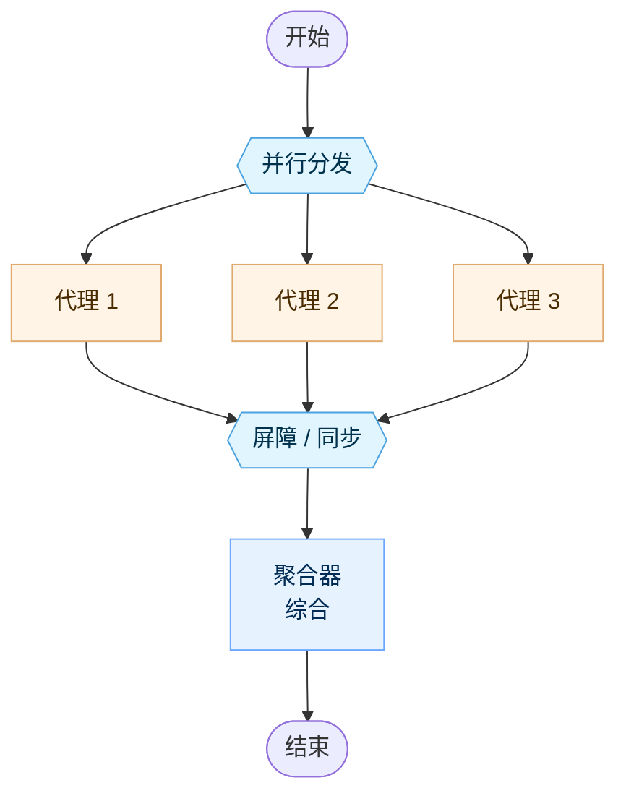
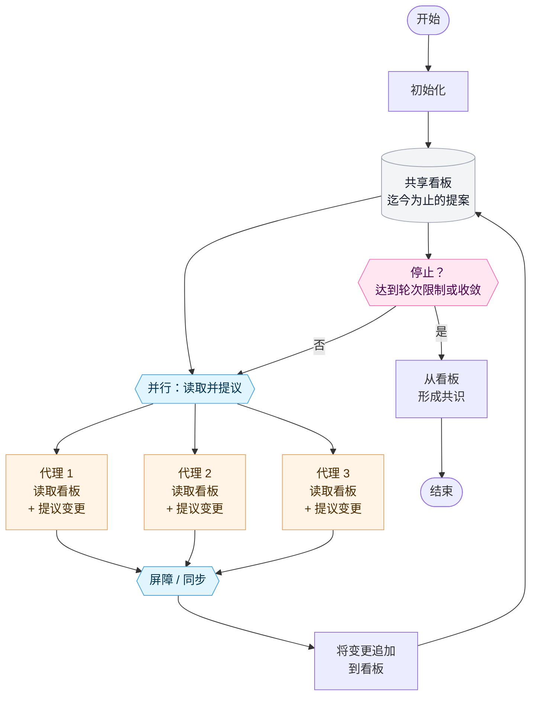
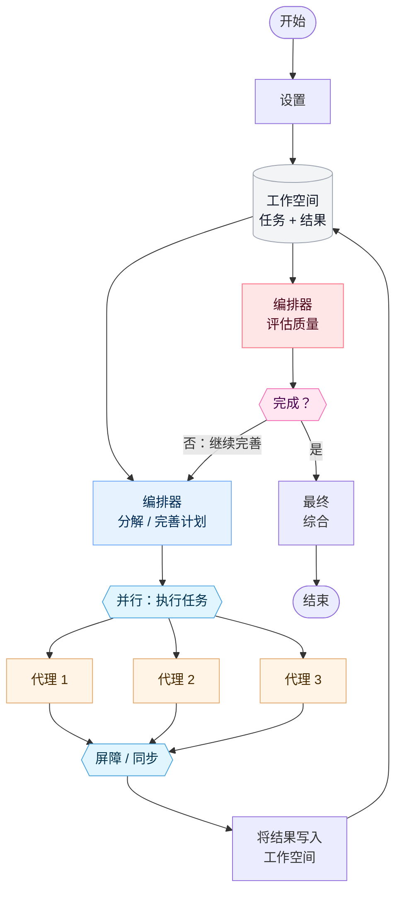
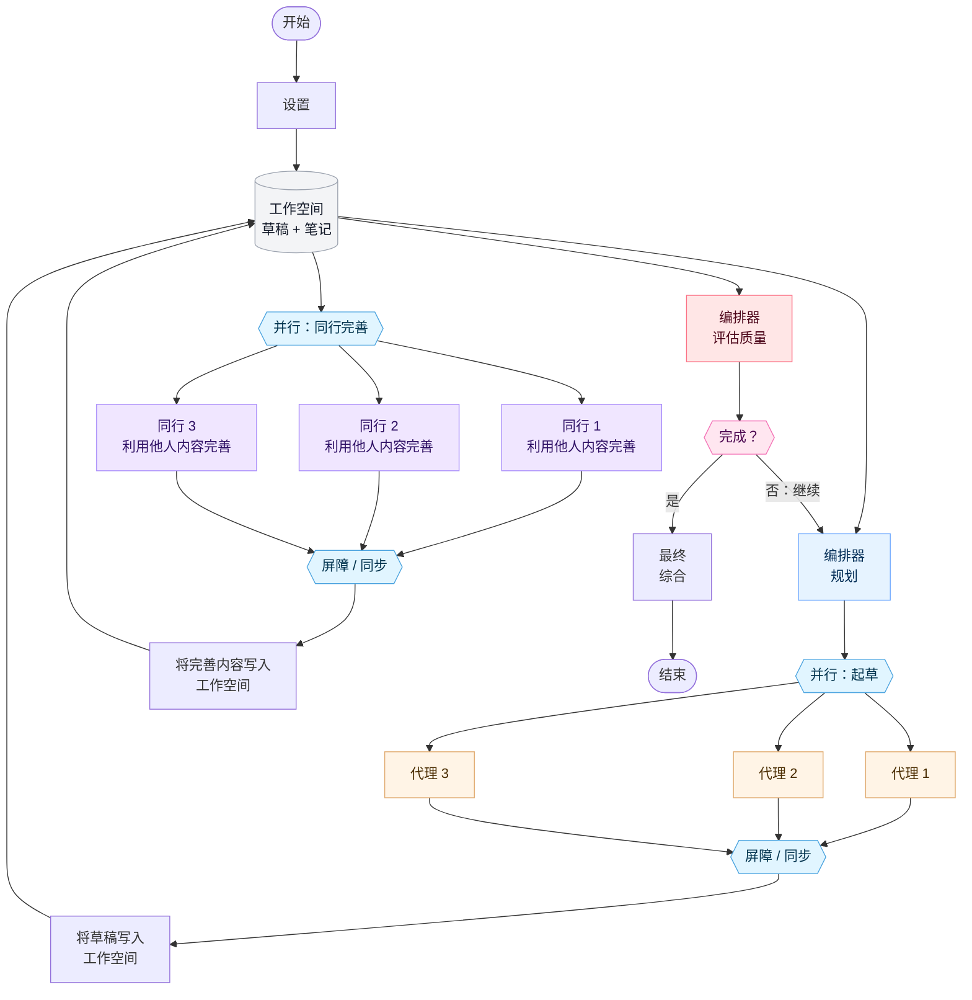

Ante 支持多种模式来组织代理协同工作。每种架构都在自主性、协调开销和结果质量之间进行权衡。

## Independent（独立模式）

代理们并行处理同一个问题，彼此之间没有交互。聚合器在最后综合它们的输出。

**最适合：** 多样化独立视角能提高质量的任务（头脑风暴、冗余验证）。

## Decentralized（去中心化模式）

代理们在并行的轮次中运行，读取彼此先前的输出并提出完善建议。经过固定数量的轮次后，在没有中央协调者的情况下形成共识。

**最适合：** 辩论式推理、同行评审，或者不应该由单一权威主导的谈判。

## Centralized Iterative（集中迭代模式）

一个中央编排器分解问题，并行分发代理，评估它们的结果，并决定是继续完善还是结束。

**最适合：** 受益于具有质量关卡的自上而下规划的复杂任务（带有代码审查的代码生成、多步骤研究）。

## Hybrid Iterative（混合迭代模式）

将集中编排与去中心化的同行审查相结合。编排器规划并分发代理，然后代理在一个同行评审轮次中相互完善彼此的工作，之后编排器再进行评估。

**最适合：** 结构化规划和同行反馈同等重要的高质量协作输出（协作写作、架构设计）。

## 选择架构

| 架构 | 协调机制 | 迭代方式 | 何时使用 |
|---|---|---|---|
| **Independent（独立模式）** | 无 | 单次 | 需要多样化视角且不希望有交互开销时 |
| **Decentralized（去中心化模式）** | 点对点 | 固定轮次 | 代理应在没有中央权威的情况下自组织时 |
| **Centralized Iterative（集中迭代模式）** | 编排器驱动 | 质量门控 | 需要具有评估检查点的结构化分解任务时 |
| **Hybrid Iterative（混合迭代模式）** | 编排器 + 同行 | 质量门控 | 既需要自上而下的规划，又需要自下而上的同行完善时 |
