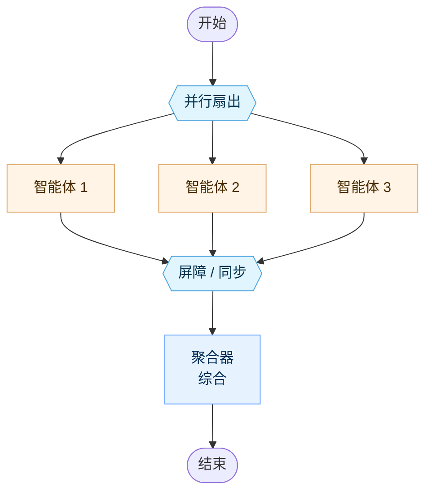
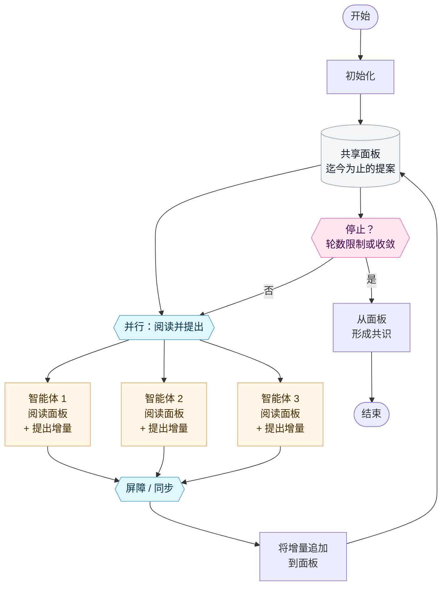
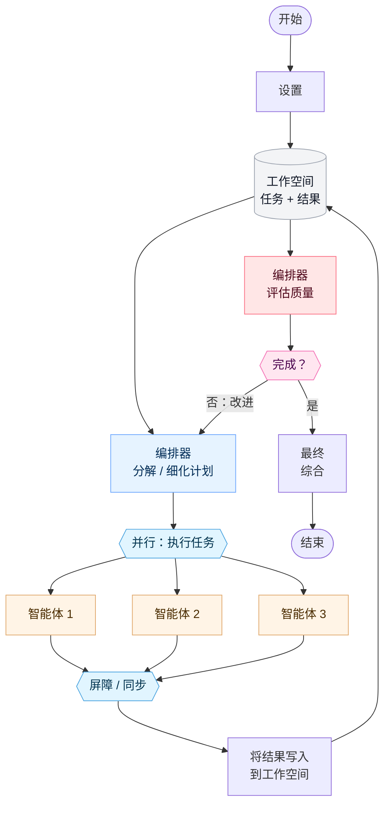
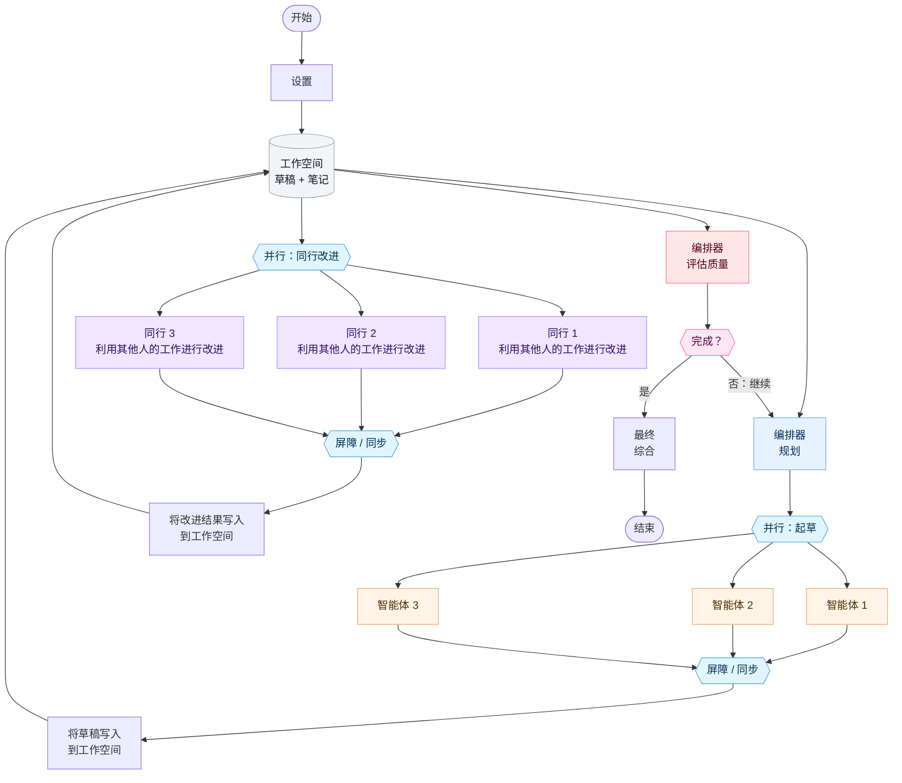

Ante 支持多种用于组织智能体协同工作的模式。每种架构都在自主性、协调开销和结果质量之间进行权衡。

## 独立模式 {#independent}

智能体在同一个问题上并行工作，彼此之间没有交互。聚合器会在最后综合它们的输出。

**最适合：** 多样化、独立视角能提高质量的任务（头脑风暴，冗余验证）。

## 去中心化模式 {#decentralized}

智能体在平行的轮次中运行，阅读彼此先前的输出并提出修改建议。在经过固定轮数后，无需中央协调器即可形成共识。

**最适合：** 辩论式推理、同行评审或谈判等不应由单一权威主导的场景。

## 集中迭代模式 {#centralized-iterative}

一个中央编排器分解问题，并行分派智能体，评估它们的结果，并决定是继续改进还是结束。

**最适合：** 具有质量关卡的自上而下的规划能带来好处的复杂任务（带有代码审查的代码生成，多步骤研究）。

## 混合迭代模式 {#hybrid-iterative}

将集中式的编排与去中心化的同行评审改进相结合。编排器计划并分派智能体，然后智能体在对等轮次中相互改进对方的工作，之后再由编排器进行评估。

**最适合：** 需要结构化计划和同行反馈的高质量协作输出（协作写作，架构设计）。

## 选择架构 {#choosing-an-architecture}

| 架构 | 协调方式 | 迭代方式 | 使用时机 |
|---|---|---|---|
| **独立模式** | 无 | 单次通过 | 需要多样化的视角且无需交互开销时 |
| **去中心化模式** | 点对点 | 固定轮数 | 智能体应该在没有中央权威的情况下自我组织时 |
| **集中迭代模式** | 编排器驱动 | 质量关卡 | 需要带有评估检查点的结构化任务分解时 |
| **混合迭代模式** | 编排器 + 同行 | 质量关卡 | 既需要自上而下的规划，又需要自下而上的同行改进时 |
