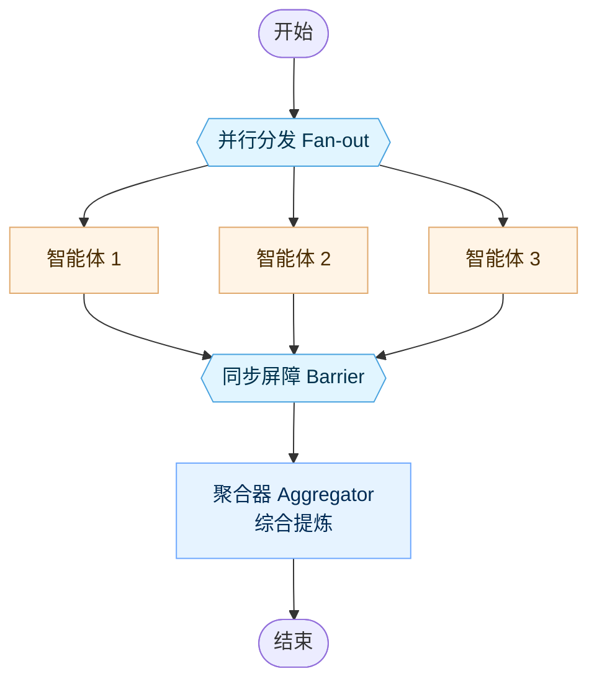
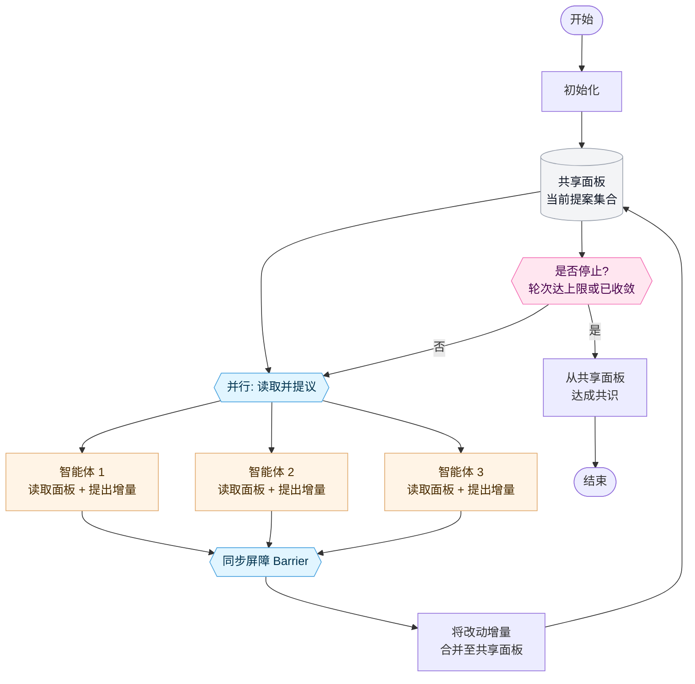
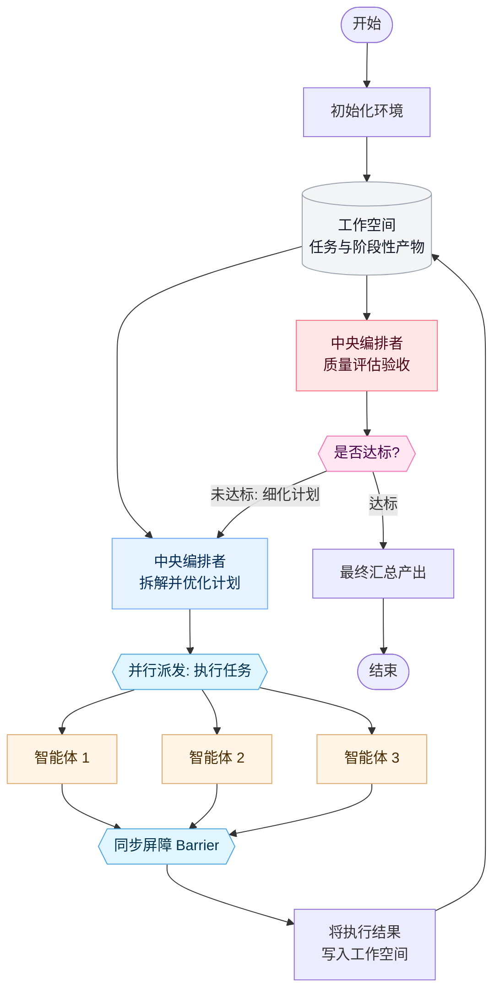

# 智能体组织架构（Agent Organization，实验性）

Ante 支持多种组织智能体协同工作的架构模式。不同模式在自主性、协调开销与输出质量之间提供了不同的权衡取舍。

## 独立并行模式（Independent）

智能体针对同一问题无交互地并行工作，最终由聚合器（Aggregator）统一汇总提炼结论。

**适用场景：** 多元独立视角能够显著提升结果质量的任务（头脑风暴、多路冗余交叉验证）。

## 去中心化协同模式（Decentralized）

智能体分轮次并行运行，读取其他智能体前序轮次的提案并提交改进意见。在固定轮次后，无需中心协调者即可自主形成共识。

**适用场景：** 辩论式推理、同行评审（Peer Review）或不应由单一权威主导的方案协商。

## 中心化迭代模式（Centralized Iterative）

由中央编排者（Orchestrator）拆解问题、并行派发任务给子智能体、评估结果质量，并决定继续微调还是完成输出。

**适用场景：** 受益于自顶向下严密规划与质量关卡（Quality Gate）的复杂任务（带自动化 Code Review 的代码生成、多阶段深度调研）。

## 混合迭代模式（Hybrid Iterative）

将中心化编排与去中心化同行互评相融合。编排者负责规划并分发任务，随后智能体之间互相审查润色，最后由编排者做全局质量评估。

**适用场景：** 对产出质量要求极高的协作型任务（技术写作、大型架构设计）。

## 架构选型对照

| 架构模式 | 协调机制 | 迭代方式 | 适用场景 |
|---|---|---|---|
| **独立并行（Independent）** | 无 | 单轮直出 | 需要多角度独立见解且无交互开销 |
| **去中心化（Decentralized）** | 点对点 Peer-to-peer | 固定轮次 | 智能体在无中心权威下自组织收敛 |
| **中心化迭代（Centralized Iterative）** | 编排者驱动 | 质量关卡驱动 | 具备明确把关点的结构化拆解与迭代 |
| **混合迭代（Hybrid Iterative）** | 编排者 + 同行互评 | 质量关卡驱动 | 兼顾顶层战略规划与底层精细互评 |
