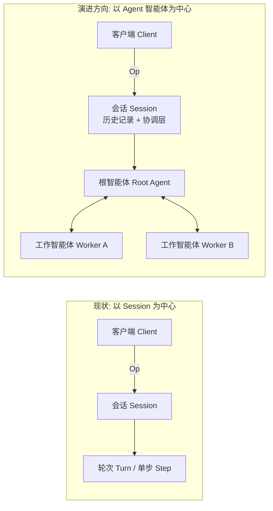

# 系统架构设计（Architecture）

Ante 采用清晰的**客户端-守护进程（Client-Daemon）**解耦架构。前端展示层与底层核心执行引擎通过异步消息传递进行解耦，使得切换终端交互前端（TUI、无头 CLI、Web UI）时底层引擎完全保持不变。

## 客户端与守护进程划分

```
┌────────────────┐          ┌─────────────────────────────┐
│     Client     │    Op    │          Daemon             │
│                │ ───────▶ │                             │
│  TUI / Headless│          │  Session ─▶ Turn ─▶ Step    │
│  或 Serve 服务  │ ◀─────── │                             │
│                │    Evt   │  Tools    Providers   Store │
└────────────────┘          └─────────────────────────────┘
```

- **Client（客户端）** — 负责用户交互与展示。包括基于 Ratatui 的交互式 TUI、无头 CLI 运行器，或通过 `ante serve` 连接的外部插件。向守护进程发送 `Op` 指令并渲染接收到的 `Evt` 事件。
- **Daemon（守护进程）** — 核心引擎。接收操作指令、管理会话生命周期、调用大语言模型提供商、调度工具安全执行并分发事件流。
- **Transport（传输层）** — 进程内通信使用 Tokio 异步有界通道；外部进程使用基于 stdin/stdout 的 JSONL 协议或 WebSocket。

## 架构演进：从以会话为中心到以智能体为中心

Ante 正从初期的“以 Session 为中心”架构迈向**“以 Agent 智能体为中心（Agent-centric）”**的现代运行时架构。



这种类似 Actor 模型的架构优势包括：
- 任务与子智能体之间具备更彻底的状态隔离
- 每个智能体拥有清晰的独立记忆、权限及工具预算
- 针对大规模多智能体并发编排具备更强的扩展性

## 模型提供商适配体系

Ante 保持跨提供商的完全中立。内置支持 Anthropic、OpenAI、Gemini、Vertex AI、Grok (xAI)、智谱 Zai、DeepSeek、Open Router、阿里 Coding Plan、Antix 企业网关及本地 llama.cpp。

流式响应具备断线自动重连与超时自愈机制。
