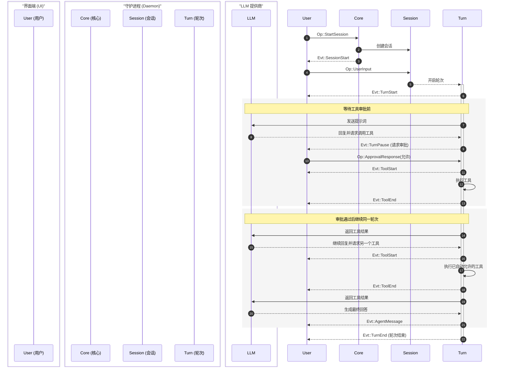
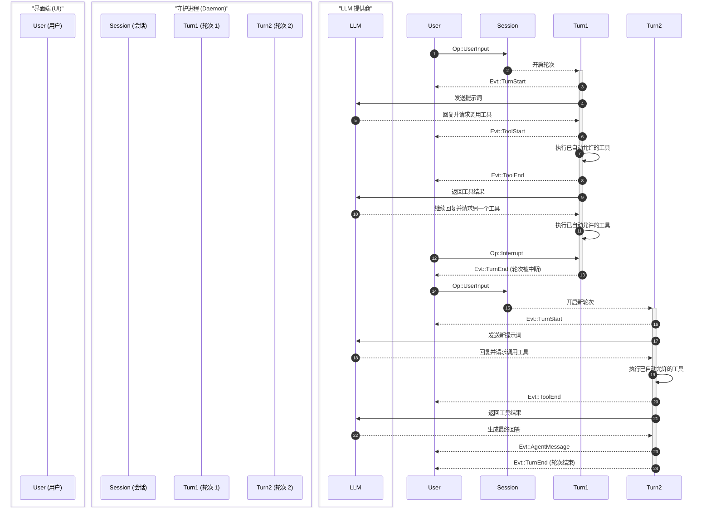

Ante 将智能体的交互过程建模为一个层级概念体系，并通过类型化的消息传递协议将它们连接起来。

## 概念层级 {#concept-hierarchy}

```
项目 (Project)
 └── 会话 (Session)
      └── 任务 (Task)
           └── 轮次 (Turn)
                └── 步骤 (Step)
```

| 概念 | 描述 |
|---|---|
| **项目 (Project)** | 一个 git 仓库或根目录。它可以包含多个会话。 |
| **会话 (Session)** | 用户与 Ante 之间的一次互动周期。负责管理对话状态、Token 消耗以及上下文压缩。 |
| **任务 (Task)** | 用户希望完成的一项特定工作。可以跨越多个轮次（turns）。 |
| **轮次 (Turn)** | 与智能体之间的一次往复交互。始于用户的输入，结束于智能体的最终回复或发出工具审批请求之时。 |
| **步骤 (Step)** | 智能体与 LLM 之间的一次独立交互。负责处理工具调用及其他相关机制。 |

:::note
通常情况下，如果没有遇到因审批而发生的中断，一项任务仅由一个轮次（turn）构成。
:::

## 协议：操作 (Ops) 与事件 (Events) {#protocol-ops-and-events}

Ante 在客户端（TUI 或无头模式运行器）与守护进程之间使用了消息传递协议。操作（`Op`）从客户端流向守护进程，而事件（`Evt`）则从守护进程流回客户端。

### 消息 IDs {#message-ids}

每条消息都带有一个自定义类型的 `Id`，并配以用于追踪溯源的 4 字节前缀：

- `op_` — 操作 (operations)
- `evt_` — 事件 (events)
- `ses_` — 会话 (sessions)
- `step_` — 步骤 (steps)

## 操作参考 {#operations-reference}

操作（`Op`）由客户端发送至守护进程，并在外层包裹一个带有唯一 `Id` 的 `OpMsg` 信封结构。

| 操作 | 载荷 (Payload) | 描述 |
|---|---|---|
| `StartSession` | `SessionConfig` | 带着指配模型、提供商、相应授权政策以及环境选项开启一项全新的系统会话。 |
| `UpdateSession` | `SessionUpdate` | 实现针对现有正在运作过程之中的系统进行不停机条件状况下的内容替换换血翻修动作操作 (就比如说实施对底层调派配置模型架构的更换等应用)。 |
| `ResumeSession` | `session_id` | 恢复重现找回先前经过存盘保存过的老记录会话内容过程。 |
| `UserInput` | `String` | 发出呈递下发用户专属的指引型任务指令。 |
| `Steer` | `String` | 对于当值运转期间回合追加赋予外加特别指引方向操作管控指导干预介入提示信息内容支持。 |
| `ApprovalResponse` | `turn_id`, `responses: [(tool_id, ReviewDecision)]` | 进行对于发向需做出明确答复表决是否同意接受系统调度派遣去调用开启某个特定扩展应用扩展组件时执行发出的相关决议反馈指令信息传送回执动作。 |
| `SlashCommand` | `name`, `args` | 以给定传唤专用调用花名形式代指执行去叫通使用对应相关特殊专属应用辅助模块功能。 |
| `RegisterLocalProvider` | `port`, `model?` | 行使将当前正置于就位且可以应招响应指使驱使调令行使职责运转当班里的属于本地专属服务供给应用对象那份 llama-server 挂号做记录登录认证挂进名册视作代表了当前 `local` 系统基础支撑供应商角色的配置登记手续操作动作。 |
| `RestoreLocalProvider` | — | 使曾经已经经过登录在册系统保留案底承认的那份本地挂靠专服提供对象相关连配置原状重现调回找回再次使其重现顶替挂靠恢复起用操作指令。 |
| `Interrupt` | — | 强制立刻叫停斩断任何当下正在进行的全部有关关联任务操作并全面收队止息结束业务办理指令发落动作。 |
| `Shutdown` | — | 行使正常宣告进入业务关闭撤出清退善后的平和退出安全平稳有序实施落幕打烊指令要求请求动作。 |

## 事件参考 {#events-reference}

事件（`Evt`）由守护进程发放反向送递给外部前端客户端处；在外被严实包扎密封在一套被系统特定命名指称为名为 `EventMsg` 特别专属形式构型的消息封装套匣里面，里面带有事件戳及独特 `Id` 以及能够顺藤摸瓜引向关联当初启动诱发此次反向反馈结果操作动作事件指令那个非必然自带且只起引导挂靠附带提示功能的任选从属标项 `parent` ID 等相关联指示物一并包容收纳其中共同传递发送而至。

| 事件 | 载荷 (Payload) | 描述 |
|---|---|---|
| `SessionStart` | `SessionInitialized` | 会话初始化已完成，附带模型、提供商、会话 ID 和工作目录。 |
| `SessionUpdated` | `SessionInitialized` | 会话在原位进行更新操作（例如：发生了替换调整相关模型部署的变动等事项）。 |
| `SessionEnd` | — | 会话宣告终止完成。 |
| `TurnStart` | `turn_id` | 一项崭新的执行循环批次启动开始。 |
| `TurnPause` | `turn_id`, `reason` | 会话轮次遇到阻碍中断（例如系统发出申请等待着执行审批去批准开启工具操作）。 |
| `TurnEnd` | `turn_id`, `status` | 会话轮次完成了全部动作、中途遭受截断阻断或者是碰到问题出差错了结束运作了。 |
| `AgentMessage` | `String` | 从智能体发来的全完文本信息的回复反馈。 |
| `Thinking` | `String` | 完全整合在一起连贯性的用于显示推导分析过程步骤想法（chain-of-thought）逻辑链组块内容。 |
| `MessageDelta` | `String` | 一份份被撕碎成一块块小片流传输着用于逐个连续递传显示发来的源属于智能体系正文信息体切块（chunk）分流数据段落。 |
| `ThinkingDelta` | `String` | 同上类似以串流断档发信模式一点点流涌推来显示说明推敲琢磨环节思虑想法过程记录的片断型组合构成块流体流数据成分内容。 |
| `ToolStart` | `ToolUse` | 指定执行使用的组件执行作业正式开始运作行动了。 |
| `ToolUpdate` | `tool_use_id`, `seq`, `message` | 工具在工作履行当中汇报进度相关动态的更新告知提示信息传报。 |
| `ToolEnd` | `tool_use_id`, `status`, `result_json`, `is_error` | 工具执行结束。 |
| `UsageUpdate` | `usage` | Token 使用量统计。 |
| `CompactStart` | — | 对话压缩开始。 |
| `CompactEnd` | — | 对话压缩完成。 |
| `ExtensionRefreshed` | `skills`, `subagents` | 技能和子智能体已重新加载。 |
| `UserInput` | `String` | 仅用于恢复会话时重放历史输入，不会出现在实时轮次中。 |
| `Info` | `String` | 普通提示信息。 |
| `Error` | `String` | 错误信息。 |
| `Goodbye` | — | 断开连接前的最后一条消息。 |

:::note
如果需要查看完整的传输格式示例和类型定义，请参阅[协议参考](/reference/protocol-reference)。
:::

## 运行流向案例示范 (Flow examples) {#flow-examples}

### 基础交互界面流程演示 (Basic UI flow) {#basic-ui-flow}

下面的例子展示一次用户输入如何因为等待工具审批而暂停（`TurnPause`），并在用户批准后继续执行：



### 中断流程 (Interruption flow) {#interruption-flow}

如果用户在任务执行途中输入新指令，当前轮次会被中断，然后启动新的轮次：



## 上下文管理 (Context management) {#context-management}

Ante 会自动管理上下文窗口：

- **Token 预算** — 每一轮都会根据当前模型的上下文上限跟踪 Token 使用量。
- **自动压缩** — 当对话接近上下文上限时，Ante 会让模型总结历史对话，保留重要信息并释放上下文空间。
- **工具结果裁剪** — 过大的工具输出会被自动裁剪，避免超过上下文预算。

## 权限 {#permissions}

Ante 的权限系统用于控制工具能否执行。规则按“先匹配先应用”的顺序求值，结果只有三种：**允许（Allow）**、**询问（Ask）** 或 **拒绝（Deny）**。完整说明请参阅[权限配置](/configuration/permission)。
