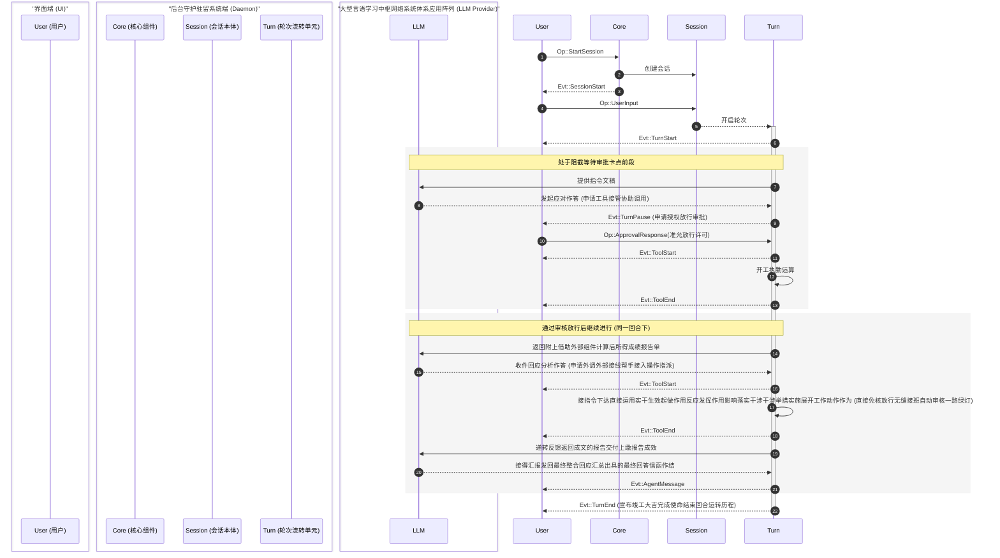
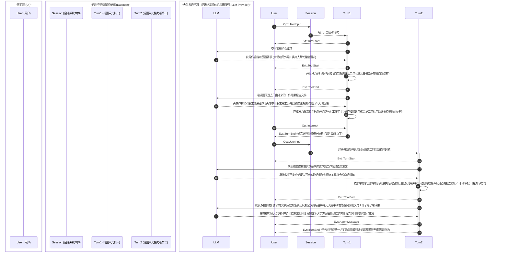

Ante 将智能体的交互过程建模为一个层级概念体系，并通过类型化的消息传递协议将它们连接起来。

## 概念层级 {#concept-hierarchy}

```
项目 (Project)
 └── 会话 (Session)
      └── 任务 (Task)
           └── 轮次 (Turn)
                └── 步骤 (Step)
```

| 概念 | 描述 |
|---|---|
| **项目 (Project)** | 一个 git 仓库或根目录。它可以包含多个会话。 |
| **会话 (Session)** | 用户与 Ante 之间的一次互动周期。负责管理对话状态、Token 消耗以及上下文压缩。 |
| **任务 (Task)** | 用户希望完成的一项特定工作。可以跨越多个轮次（turns）。 |
| **轮次 (Turn)** | 与智能体之间的一次往复交互。始于用户的输入，结束于智能体的最终回复或发出工具审批请求之时。 |
| **步骤 (Step)** | 智能体与 LLM 之间的一次独立交互。负责处理工具调用及其他相关机制。 |

:::note
通常情况下，如果没有遇到因审批而发生的中断，一项任务仅由一个轮次（turn）构成。
:::

## 协议：操作 (Ops) 与事件 (Events) {#protocol-ops-and-events}

Ante 在客户端（TUI 或无头模式运行器）与守护进程之间使用了消息传递协议。操作（`Op`）从客户端流向守护进程，而事件（`Evt`）则从守护进程流回客户端。

### 消息 IDs {#message-ids}

每条消息都带有一个自定义类型的 `Id`，并配以用于追踪溯源的 4 字节前缀：

- `op_` — 操作 (operations)
- `evt_` — 事件 (events)
- `ses_` — 会话 (sessions)
- `step_` — 步骤 (steps)

## 操作参考 {#operations-reference}

操作（`Op`）由客户端发送至守护进程，并在外层包裹一个带有唯一 `Id` 的 `OpMsg` 信封结构。

| 操作 | 载荷 (Payload) | 描述 |
|---|---|---|
| `StartSession` | `SessionConfig` | 带着指配模型、提供商、相应授权政策以及环境选项开启一项全新的系统会话。 |
| `UpdateSession` | `SessionUpdate` | 实现针对现有正在运作过程之中的系统进行不停机条件状况下的内容替换换血翻修动作操作 (就比如说实施对底层调派配置模型架构的更换等应用)。 |
| `ResumeSession` | `session_id` | 恢复重现找回先前经过存盘保存过的老记录会话内容过程。 |
| `UserInput` | `String` | 发出呈递下发用户专属的指引型任务指令。 |
| `Steer` | `String` | 对于当值运转期间回合追加赋予外加特别指引方向操作管控指导干预介入提示信息内容支持。 |
| `ApprovalResponse` | `turn_id`, `responses: [(tool_id, ReviewDecision)]` | 进行对于发向需做出明确答复表决是否同意接受系统调度派遣去调用开启某个特定扩展应用扩展组件时执行发出的相关决议反馈指令信息传送回执动作。 |
| `SlashCommand` | `name`, `args` | 以给定传唤专用调用花名形式代指执行去叫通使用对应相关特殊专属应用辅助模块功能。 |
| `RegisterLocalProvider` | `port`, `model?` | 行使将当前正置于就位且可以应招响应指使驱使调令行使职责运转当班里的属于本地专属服务供给应用对象那份 llama-server 挂号做记录登录认证挂进名册视作代表了当前 `local` 系统基础支撑供应商角色的配置登记手续操作动作。 |
| `RestoreLocalProvider` | — | 使曾经已经经过登录在册系统保留案底承认的那份本地挂靠专服提供对象相关连配置原状重现调回找回再次使其重现顶替挂靠恢复起用操作指令。 |
| `Interrupt` | — | 强制立刻叫停斩断任何当下正在进行的全部有关关联任务操作并全面收队止息结束业务办理指令发落动作。 |
| `Shutdown` | — | 行使正常宣告进入业务关闭撤出清退善后的平和退出安全平稳有序实施落幕打烊指令要求请求动作。 |

## 事件参考 {#events-reference}

事件（`Evt`）由守护进程发放反向送递给外部前端客户端处；在外被严实包扎密封在一套被系统特定命名指称为名为 `EventMsg` 特别专属形式构型的消息封装套匣里面，里面带有事件戳及独特 `Id` 以及能够顺藤摸瓜引向关联当初启动诱发此次反向反馈结果操作动作事件指令那个非必然自带且只起引导挂靠附带提示功能的任选从属标项 `parent` ID 等相关联指示物一并包容收纳其中共同传递发送而至。

| 事件 | 载荷 (Payload) | 描述 |
|---|---|---|
| `SessionStart` | `SessionInitialized` | 会话初始化已完成，附带模型、提供商、会话 ID 和工作目录。 |
| `SessionUpdated` | `SessionInitialized` | 会话在原位进行更新操作（例如：发生了替换调整相关模型部署的变动等事项）。 |
| `SessionEnd` | — | 会话宣告终止完成。 |
| `TurnStart` | `turn_id` | 一项崭新的执行循环批次启动开始。 |
| `TurnPause` | `turn_id`, `reason` | 会话轮次遇到阻碍中断（例如系统发出申请等待着执行审批去批准开启工具操作）。 |
| `TurnEnd` | `turn_id`, `status` | 会话轮次完成了全部动作、中途遭受截断阻断或者是碰到问题出差错了结束运作了。 |
| `AgentMessage` | `String` | 从智能体发来的全完文本信息的回复反馈。 |
| `Thinking` | `String` | 完全整合在一起连贯性的用于显示推导分析过程步骤想法（chain-of-thought）逻辑链组块内容。 |
| `MessageDelta` | `String` | 一份份被撕碎成一块块小片流传输着用于逐个连续递传显示发来的源属于智能体系正文信息体切块（chunk）分流数据段落。 |
| `ThinkingDelta` | `String` | 同上类似以串流断档发信模式一点点流涌推来显示说明推敲琢磨环节思虑想法过程记录的片断型组合构成块流体流数据成分内容。 |
| `ToolStart` | `ToolUse` | 指定执行使用的组件执行作业正式开始运作行动了。 |
| `ToolUpdate` | `tool_use_id`, `seq`, `message` | 工具在工作履行当中汇报进度相关动态的更新告知提示信息传报。 |
| `ToolEnd` | `tool_use_id`, `status`, `result_json`, `is_error` | 所调用工具干活处理告一段落彻底落幕收场完成各项事务收束完毕动作发生时发出。 |
| `UsageUpdate` | `usage` | 代币量开销情况和占有额度耗费的有关统计核算计费指标资料传达。 |
| `CompactStart` | — | 回顾过往聊天历史对其开展紧凑压减瘦身压缩行动工序正式展开。 |
| `CompactEnd` | — | 此轮聊天回忆资料去冗存精瘦身减重行动的加工环节大功告成圆满竣工了。 |
| `ExtensionRefreshed` | `skills`, `subagents` | 对于各路技能帮手以及各类次级干活随从代理助理们状态名单等信息的清点换新资料重刷结果播报。 |
| `UserInput` | `String` | 只专为了提供系统重温复述那些沉寂过往昔日经历的被录入保存事件而复用来发声显示的，并不会发生呈现在直接交流应对对话的当时情况里展示出来这般景象情形存在。 |
| `Info` | `String` | 用于传送下发的一般常规属性的情报告知通告说明提示类的常规信息文段。 |
| `Error` | `String` | 报错警报的异常差错类报告通知文案信息。 |
| `Goodbye` | — | 宣告结束前最后的一声辞别绝唱通报信息。 |

:::note
对于查阅理解有关于具备针对网络流传递封装形式格式呈现指引相关内容连同完整列举列出的所有全方位涉及的类别数据构造型的详细剖析详尽解析通讲信息大观可以从查阅跳转浏览查看着重讲解指引的这篇专门用来解惑的[协议参考](/reference/protocol-reference)全编纲目专版取得详实资料内容。
:::

## 运行流向案例示范 (Flow examples) {#flow-examples}

### 基础交互界面流程演示 (Basic UI flow) {#basic-ui-flow}

在这个只历经由用户抛出单一话题输入的场合经历里，一次往复交互应对处理在等待准许命令批准下发这道门槛被硬性拦截卡住中断执行了 (`TurnPause`)，直至获得了审核绿灯通行放行之后它才复又再度起步衔接接力后续工作运转的走势经历记录景象：



### 强行叫停截断流向控制的处置手段经过 (Interruption flow) {#interruption-flow}

在执行任务途中直接腰斩劈空终止一项目前仍在赶进度中持续干劲正隆的应对处理轮次历程活动，紧接着又向系统灌输重新置入一道新任务输入指令接着往下运转下去：



## 文本交际与资料保存空间上下文内容的筹算管理 (Context management) {#context-management}

关于如何精打细算使用维护与调控管控文段语境信息内容的记录范围容纳尺度边界由系统负责进行自动化管理介入支配管理统御全局调度发挥作用的：

- **资源代币量的统计测算配额核减预算支配把控制约 (Token budget)** — 对着每度运转更迭新的一局会话流交替周转运作的每笔开销都一并进行对着相应挂载调遣运作着关联服务支持所提供商承诺可最高承压吃透受容量顶限的天花板基准度盘核计算度衡量测度的计数账册本簿进行扣点统计消减记录进行精打细算掌控监督
- **系统底层原生自我约束内卷自适应强制压舱修整去粗取精去臃缩肿资料挤水瘦身大回环操作流程处理 (Auto-compaction)** — 每每碰巧处于双方你来我往连番轮番交互唇枪舌剑一番产生的一大通对白话语堆叠累积得体积量已是直逼抵进到了规定限定要求承重限额边沿告急红灯亮起警戒临界位置当口之际这个千钧一发时刻之时，Ante 此刻将启用触发直接发下指令遣将指派底层主力 LLM 智脑直接下场挂帅开展行动执行就着现手留存收归掌握记录案卷的这一摊子海量庞杂来往文本档案资料堆开展进行概括梳理删繁就简提纲挈领般的高浓缩精粹收整摘要汇总总结归纳加工生产处理动作手段步骤过程了，借着对有参考价值保留意义不可丢弃割舍要义内文做重点摘要记载摘录以继续维持保障原义意向精髓承传不断的根基条件下还腾让排空释出余下大把空闲闲散富裕资源使用配置限额腾出笼让供下一步行动挥霍运用空间
- **对于借助第三方辅助调用支持取得工作进展从而拿到所获取反馈成绩战报收获报告单里的废料无益冗余不实无关紧要占存占位的边角余料粗暴废弃精切剔除瘦身处理 (Tool result trimming)** — 对于某些特别体量宏大的由于调用借助外接执行应用从而收获产生出具有极度异常超大规格体量长篇大论庞然巨物模样的反馈回传处理成果数据文书文本这部分它也将强制遭受到遭受遭受施以施加绝不留情无情毫不手软自动强力直接手起刀落快刀斩乱麻干脆利落不拖泥带水大刀阔斧斩件阉割的切割整改动刀砍裁减修编强制阉割整修修改处置流程的残忍对待修理动作操作流程直到满足合规不超越标准界限红线违规红牌禁赛门槛被卡断拦截门限界点额度为止的待遇

## 使用权利指派管束管控约束门槛防线制度构件与防线设防把关关卡权限体制规则 (Permissions) {#permissions}

Ante 具备且附带构筑了一整套用于直接发号施令严加看管约束把关对动用派遣任何形式功能模块去采取行动予以授权定夺审视批准放权授权制约管理的门控拦截防护保障监管权力配置体系系统网络设置。在此其中规制管束一切判定逻辑准则是始终奉守并采用贯穿着依据秉持“优先首次配对首度命中心属意属对象当先拍板判定敲定作数起誓不悖”这么一条铁律准绳去主导演进裁决落判决策实施判案核审工作过程的；整个裁定判决结局走势判定归宿归置选项出路就只会落下出炉诞生这么能够提供出产生下设有的这么区区三个唯一的可能选择方向结果而已：**准予放行 (Allow)**, **存疑待决求教 (Ask)**, 以及干脆利落地予以无情决绝地**回绝封杀制止 (Deny)**。为了能够深挖掌握了解到获取关于它的更深入更全面更入木三分更详尽全貌巨细无遗内幕规则门道细节，请前去拜访阅览位于 [权利制度规范权限详情介绍](/configuration/permission) 专门设立开设专区专版页面以取求真经。
